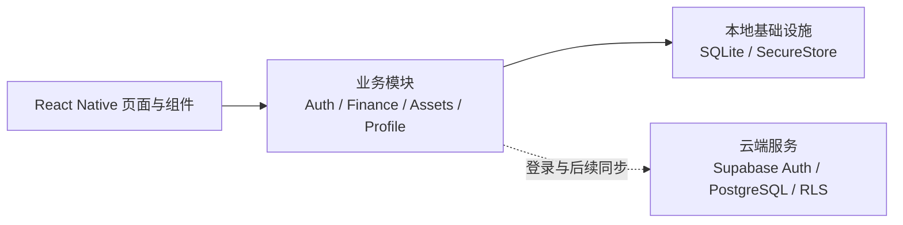

# Lifee 日序

Lifee 是一款面向 iOS 与 Android 的本地优先个人财务记录 App。它希望用轻量、年轻的交互，帮助用户快速记账、回顾收支，并逐步建立清晰的个人资产视图。

## 主要功能

- 快速记录收入与支出，支持分类、日期和备注。
- 账单明细按时间倒序分组，支持月度汇总、编辑和删除。
- 首页展示结余、收入、支出与最近记录。
- 本地手机号、国际手机号和邮箱 OTP 登录。
- GitHub、微信 OAuth 登录客户端流程。
- SecureStore 安全保存 Session 与独立 Login Hint。
- SQLite 本地持久化，无网络时也能完成核心记账操作。

> 资产管理与云端数据同步仍在开发中；短信、邮件及第三方登录需要配置 Supabase 后才能真实使用。

## 产品架构

Lifee 采用 Monorepo 与本地优先架构。移动端按业务功能拆分，认证凭证使用系统安全存储，账单数据优先写入本地 SQLite；Supabase 负责认证、PostgreSQL、RLS 和后续多设备同步。



```text
Lifee/
├── apps/mobile/                 # Expo + React Native 移动端
│   ├── src/application/         # 启动与导航
│   ├── src/components/          # 通用交互组件
│   ├── src/core/                # SQLite、Supabase、配置与安全存储
│   ├── src/design/              # 主题与设计令牌
│   ├── src/features/            # 按业务领域拆分的功能模块
│   └── supabase/                # 数据库迁移与认证配置说明
└── packages/shared/             # 跨模块共享类型
```

## 技术栈

- Expo、React Native、TypeScript
- React Navigation、Zustand
- Expo SQLite、Expo SecureStore
- Supabase Auth、PostgreSQL、Row Level Security
- pnpm Workspace

## 本地运行

```bash
pnpm install
cp apps/mobile/.env.example apps/mobile/.env
pnpm dev:mobile
```

未配置 Supabase 时，应用以本地模式运行，并可在“我的”页面预览登录界面。客户端只允许使用 Supabase URL 与 Anon/Publishable Key，禁止将 `service_role`、短信密钥或 OAuth Secret 写入 `EXPO_PUBLIC_*`。

常用命令：

```bash
pnpm ios
pnpm android
pnpm typecheck
pnpm lint
```

## License

[MIT](./LICENSE)
